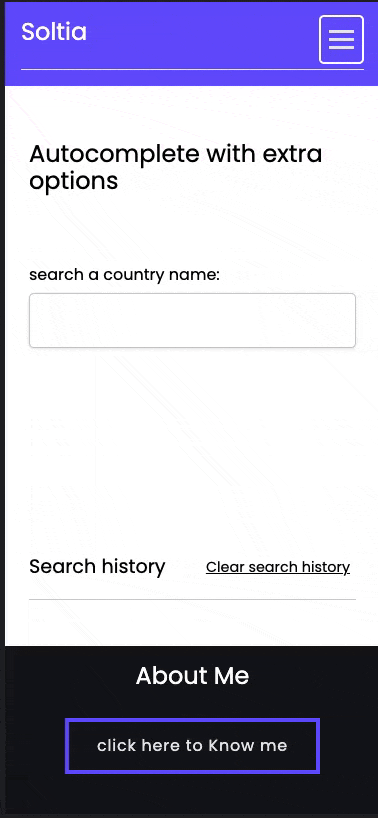

# 🚀 Soltia task

Auto complete search with extra options.

[Demo]()

 

## ✨ Features

- Write with the care of accessibility
- Work with keyboard(Esc, Tab, Enter, Space, Arrow up and down)
- Fetch with debounce to not put stress on API
- can be used inside a form tag to send selected search items to the backend
- Pure HTML, CSS and JavaScript
- Responsive
- Linting for styles and scripts

 
 
 

## 🛠 Under the hood
- Top menu is responsible and support accessibility.

- Autocomplete search fully uses Accessibility and Aria attributes. it will create the input box as a Combobox with autocomplete list attribute so users with sight issues know there will
a dropdown list with expanded or collapsed.
Also since that input box is not good for sending its data to the server because maybe the text and value
that shows on the dropdown list are different thus to prevent this issue, the hidden select tag will care that selected search item.

 
 
 
  
## 🎦 Demo
